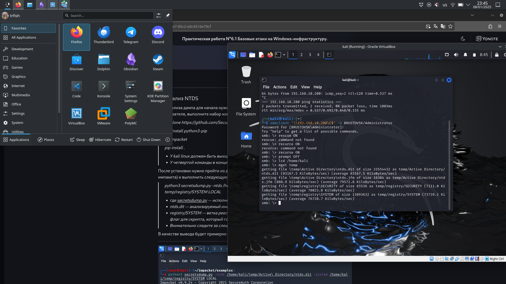
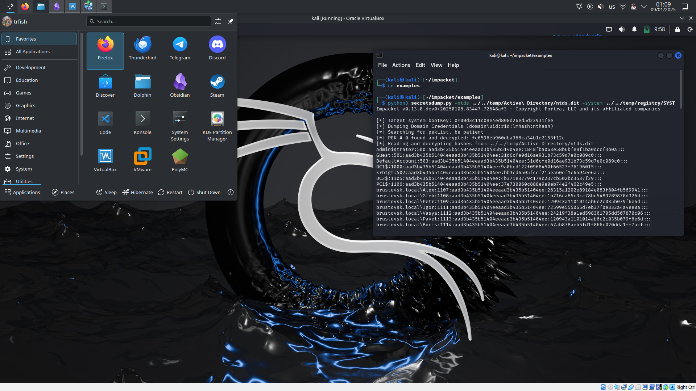
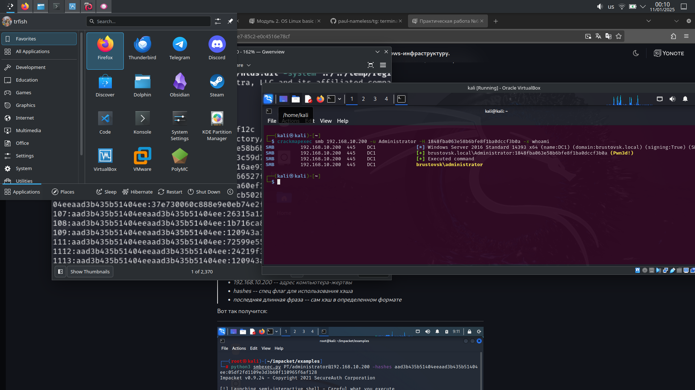
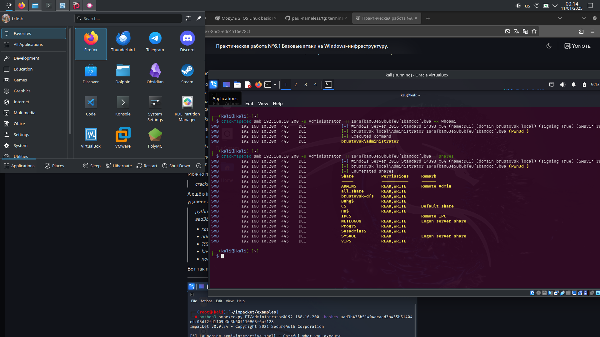
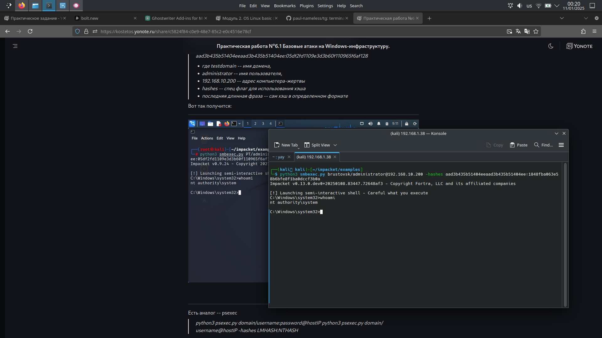
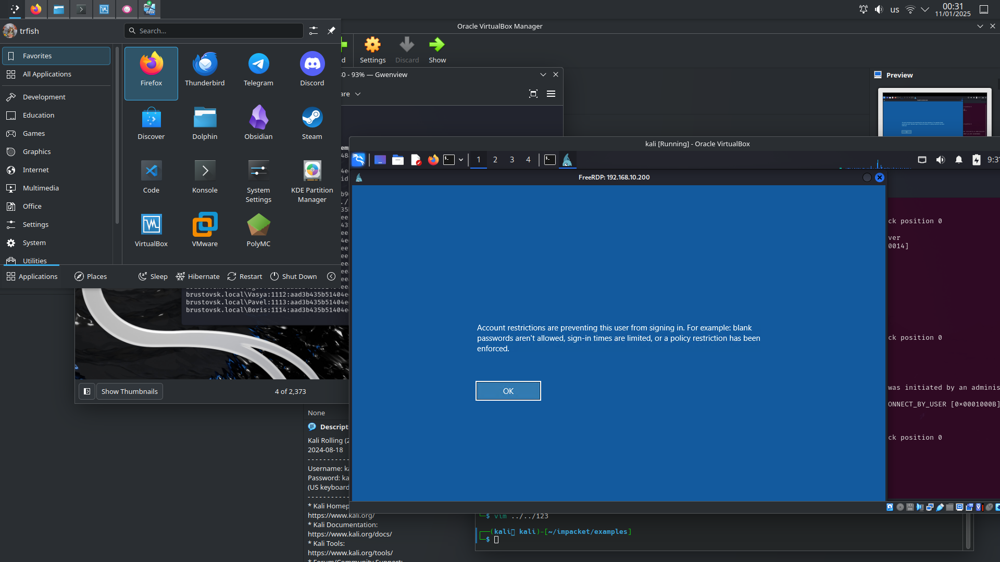
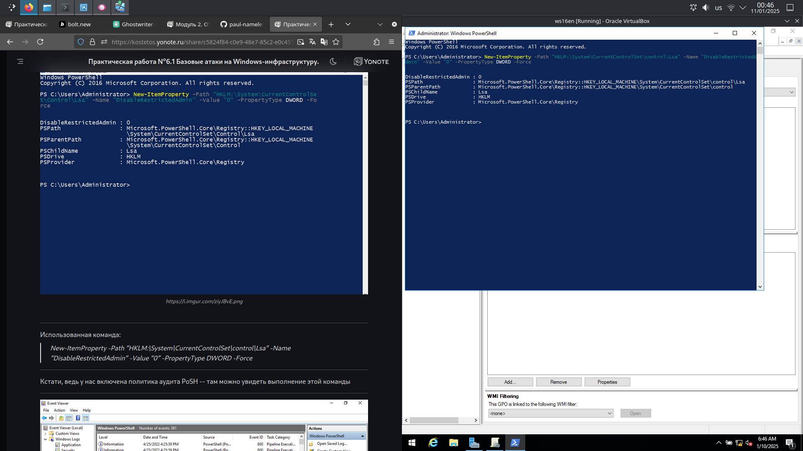

Копируем бекап ntds с dc1 на kali

Парсим бекап с помощью impacket secretsdump

Выполняем команды на dc1 с использование данных из ntds

Тоже самое, но из пакета impacket

Подключаемся к rdp без пароля, но получаем ошибку

Поправляем реестр для удаленных подключений

# responder

Анализируем LLNMR, NBNS запросы

Меняем настройки

Responder притворяется несуществующим ресурсом, поэтому видим окно аутентификации

Но резельтатов в терминале нет(

# mitm6
сетевые настройки до атаки

атака

сетевые настройки после атаки

Поднимаем сервер smb и получаем креды

